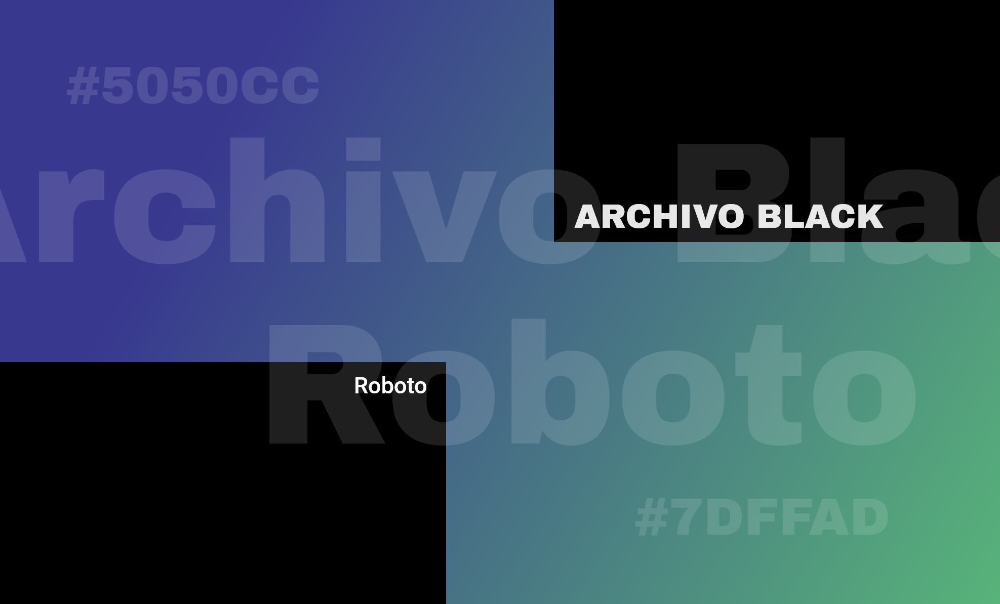
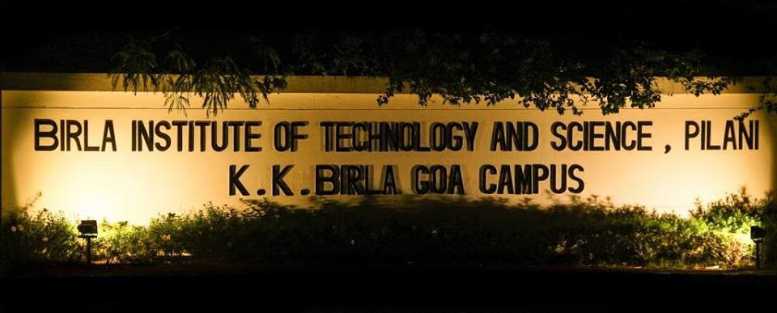

## Some fond memories of my undergraduate days at BITS Pilani, K. K. Birla Goa Campus cherished photographically as a website. 

### Colors & Typography

### Initial design concept.

### The iconic BPGC placard, the first thing you see after arriving at the campus!

Image credits: Kunal Baweja

### The B-Dome building in monsoon.

### I graduated with a B. E. ( Hons.) Computer Science. The convocation day saw a typical Goan downpour!

Image credits: The Department of Photography, BPGC

### The Computer Science class of 2019.

Image credits: The Department of Photography, BPGC

### Note
The website is under development, stay tuned! :)
Feel free to contact me at KunalX011gmail.com if you have any ideas or a contribution to the photos!
